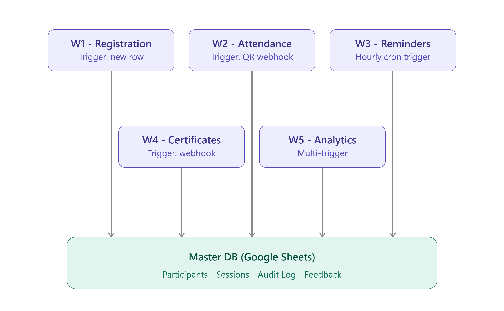

# AI-Powered Event Management Platform

An end-to-end event lifecycle automation platform built entirely on **n8n**, covering registration, QR-based attendance, automated reminders, certificate generation, and AI-driven feedback analytics — with zero manual spreadsheet work once configured.

Built as a capstone project for **Summer School '26 — N8N Capstone Project** (AI Event Management Platform).

---

## What this does

A participant registers → gets a QR code by email → gets reminded before their session → checks in by scanning the QR code at the venue → receives a personalized certificate automatically after the event → their feedback gets AI-tagged with sentiment and theme in real time → organizers get a weekly AI-written analytics digest.

All of this runs across **5 independent n8n workflows** (56 nodes total) that share a single Google Sheets database as their source of truth.

---

## Architecture

The system uses a hub-and-spoke model: every workflow reads from and writes to a shared **Master DB** (Google Sheets), rather than calling each other directly. The one physical link between workflows is the QR code — generated in W1, scanned to trigger W2.



See [`docs/02-workflow-documentation.md`](docs/02-Workflow-Documentation.md) for the full interaction diagram and event-flow timeline.

| Workflow                                       | Trigger                            | Purpose                                                                         |
| ---------------------------------------------- | ---------------------------------- | ------------------------------------------------------------------------------- |
| **W1 — Registration & Participant Management** | New row in Registration sheet      | Validates + de-duplicates sign-ups, generates a QR code, emails confirmation    |
| **W2 — QR Attendance Check-in**                | Webhook (QR scan)                  | Verifies scanned code, marks attendance, blocks duplicate check-ins             |
| **W3 — Event Reminders**                       | Hourly schedule (cron)             | Emails session reminders 24h ahead, once per participant                        |
| **W4 — Certificate Generation & Distribution** | Webhook (organizer-triggered)      | Generates a personalized PDF certificate per attendee via PDFMonkey, emails it  |
| **W5 — Feedback & Analytics**                  | New feedback row + weekly schedule | AI-tags feedback sentiment/theme; emails organizers a weekly AI-written summary |

---

## Tech stack

- **Automation:** [n8n](https://n8n.io) (self-hosted / n8n Cloud)
- **Database:** Google Sheets (Master DB with `Participants`, `Sessions`, `Registration`, `Audit Log`, `Feedback` tabs)
- **Email:** Gmail API
- **File storage:** Google Drive (QR codes, certificates)
- **PDF generation:** [PDFMonkey](https://www.pdfmonkey.io) API
- **QR generation:** api.qrserver.com
- **AI / LLM:** Nemotron (via OpenAI-compatible endpoint) for sentiment analysis and report generation

---

## Repository structure

```
├── docs/
│   ├── 01-problem-analysis.md         # Business context, stakeholders, pain points, objectives
│   ├── 02-workflow-documentation.md   # Full node-by-node breakdown of all 5 workflows
│   └── architecture-diagram.png
├── workflows/
│   ├── W1-registration-participant-management.json
│   ├── W2-qr-attendance-checkin.json
│   ├── W3-event-reminders.json
│   ├── W4-certificate-generation.json
│   └── W5-feedback-analytics.json
├── screenshots/
└── demo/
    └── demo-video-link.md
```

---

## Setup

### Prerequisites

- An [n8n](https://n8n.io) instance (cloud or self-hosted)
- A Google account with access to Sheets, Drive, and Gmail
- A [PDFMonkey](https://www.pdfmonkey.io) account with an API key and a certificate template
- An OpenAI-compatible LLM API key (used in W5)

### Steps

1. **Set up the Master DB spreadsheet** with tabs: `Registration`, `Participants`, `Sessions`, `Audit Log`, `Feedback`, `Feedback Form Responses`, matching the column schema documented in [`docs/02-workflow-documentation.md`](docs/02-Workflow-Documentation.md).

2. **Import each workflow** into your n8n instance:
   - n8n → **Workflows** → **Add workflow** → **Import from File** → select each `.json` from `/workflows`.

3. **Configure credentials** in n8n for each service used:
   - Google Sheets OAuth2
   - Google Drive OAuth2
   - Gmail OAuth2
   - PDFMonkey (Header/Bearer Auth with your API key)
   - Your LLM provider's API key

4. **Update placeholders** in each workflow:
   - `documentId` / `sheetName` references → point to your own Master DB spreadsheet
   - `document_template_id` in W4 → your PDFMonkey certificate template ID
   - `folderId` in Drive nodes → your target Google Drive folder

5. **Activate** each workflow. Note that W2 and W4 are webhook-based — copy their production webhook URLs from n8n and use them wherever the QR code is generated (W1) and wherever your organizer trigger lives, respectively.

6. **Test end-to-end** by submitting a test registration, scanning the resulting QR code (or manually hitting the check-in webhook with a test `participant_id`), and manually firing the W4 webhook to confirm certificate delivery.

---

## Known limitations / design notes

- **W4 is intentionally human-triggered.** Certificate generation is not automatically chained from attendance data — an organizer explicitly fires the `event-completed` webhook once an event concludes. This is a deliberate checkpoint, not a gap.
- Duplicate protection (registration and check-in) relies on exact-match lookups against `participant_id`; ensure email normalization (lowercase + trim) stays consistent across all entry points.
- The AI sentiment/theme extraction in W5 is only as good as the underlying LLM's classification — for production use, consider periodic manual spot-checks of tagged feedback.

---

## Documentation

- [Problem Analysis](docs/01-Problem-Analysis.md) — business context, stakeholders, pain points, objectives
- [Workflow Documentation](docs/02-Workflow-Documentation.md) — full node-by-node breakdown, schema reference, and rubric cross-reference for all 5 workflows

## Demo

See [`demo/demo-video-link.md`](demo/demo-video-link.md) for the walkthrough video.

---

## Author

Built by Keshav Khajuria as part of the Summer School '26 N8N Capstone Project.
